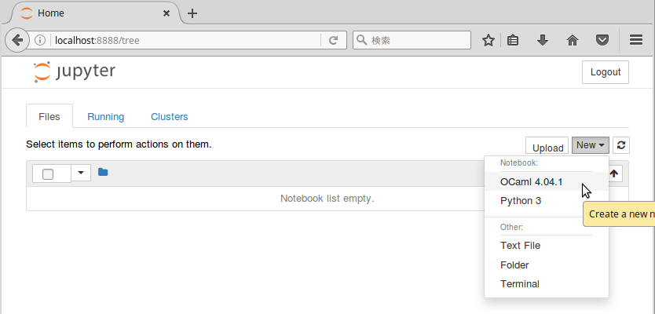

# [akabe/iocaml](https://hub.docker.com/r/akabe/iocaml/)

| Travis CI | MicroBadger |
| --- | --- |
| [](https://travis-ci.org/akabe/docker-iocaml) | [](https://microbadger.com/images/akabe/iocaml) |

Minimal environment for ready-to-use [Jupyter notebook](http://ipython.org/notebook.html) with [IOCaml kernel](https://github.com/andrewray/iocaml).

Probably you are also interested in [akabe/iocaml-datascience](https://github.com/akabe/docker-iocaml-datascience) for practical use.

## Getting started

First, launch a Jupyter server as follows.

```console
$ docker run -it -p 8888:8888 akabe/iocaml
[I 15:38:04.170 NotebookApp] Writing notebook server cookie secret to /home/opam/.local/share/jupyter/runtime/notebook_cookie_secret
[W 15:38:04.190 NotebookApp] WARNING: The notebook server is listening on all IP addresses and not using encryption. This is not recommended.
[I 15:38:04.197 NotebookApp] Serving notebooks from local directory: /notebooks
[I 15:38:04.197 NotebookApp] 0 active kernels
[I 15:38:04.197 NotebookApp] The Jupyter Notebook is running at: http://[all ip addresses on your system]:8888/?token=4df0fee0719115f474c8dd9f9281abed28db140d25f933e9
[I 15:38:04.197 NotebookApp] Use Control-C to stop this server and shut down all kernels (twice to skip confirmation).
[W 15:38:04.198 NotebookApp] No web browser found: could not locate runnable browser.
[C 15:38:04.198 NotebookApp]

    Copy/paste this URL into your browser when you connect for the first time,
    to login with a token:
        http://localhost:8888/?token=4df0fee0719115f474c8dd9f9281abed28db140d25f933e9
```

Second, access to the URL at the above last line to your web browser, then



You can create OCaml notebooks!

Notebooks on your host machine can be mounted to a Docker container by

```
docker run -it -p 8888:8888 -v $(pwd):/notebooks akabe/iocaml
```

## Distributions

The default images are built on Alpine 3.5:

| Tag | Iocaml | OPAM | Command | Dockerfile |
| ------------ | ----- | ---- | ------- | ---------- |
| **latest** | 4.04.1 | 1.2.2 | `docker pull akabe/iocaml` | [Dockerfile](dockerfiles/alpine3.5_iocaml4.04.1/Dockerfile) |
| 4.05.0 | 4.05.0+trunk | 1.2.2 | `docker pull akabe/iocaml:4.05.0` | [Dockerfile](dockerfiles/alpine3.5_iocaml4.05.0/Dockerfile) |
| 4.04.1 | 4.04.1 | 1.2.2 | `docker pull akabe/iocaml:4.04.1` | [Dockerfile](dockerfiles/alpine3.5_iocaml4.04.1/Dockerfile) |
| 4.03.0 | 4.03.0 | 1.2.2 | `docker pull akabe/iocaml:4.03.0` | [Dockerfile](dockerfiles/alpine3.5_iocaml4.03.0/Dockerfile) |
| 4.02.3 | 4.02.3 | 1.2.2 | `docker pull akabe/iocaml:4.02.3` | [Dockerfile](dockerfiles/alpine3.5_iocaml4.02.3/Dockerfile) |
| 4.01.0 | 4.01.0 | 1.2.2 | `docker pull akabe/iocaml:4.01.0` | [Dockerfile](dockerfiles/alpine3.5_iocaml4.01.0/Dockerfile) |
| 4.00.1 | 4.00.1 | 1.2.2 | `docker pull akabe/iocaml:4.00.1` | [Dockerfile](dockerfiles/alpine3.5_iocaml4.00.1/Dockerfile) |

### Alpine

| Distribution | Iocaml | OPAM | Command | Dockerfile |
| ------------ | ----- | ---- | ------- | ---------- |
| Alpine | 4.05.0+trunk | 1.2.2 | `docker pull akabe/iocaml:alpine_ocaml4.05.0` | [Dockerfile](dockerfiles/alpine3.5_ocaml4.05.0/Dockerfile) |
| Alpine | 4.04.1 | 1.2.2 | `docker pull akabe/iocaml:alpine_ocaml4.04.1` | [Dockerfile](dockerfiles/alpine3.5_ocaml4.04.1/Dockerfile) |
| Alpine | 4.03.0 | 1.2.2 | `docker pull akabe/iocaml:alpine_ocaml4.03.0` | [Dockerfile](dockerfiles/alpine3.5_ocaml4.03.0/Dockerfile) |
| Alpine | 4.02.3 | 1.2.2 | `docker pull akabe/iocaml:alpine_ocaml4.02.3` | [Dockerfile](dockerfiles/alpine3.5_ocaml4.02.3/Dockerfile) |
| Alpine | 4.01.0 | 1.2.2 | `docker pull akabe/iocaml:alpine_ocaml4.01.0` | [Dockerfile](dockerfiles/alpine3.5_ocaml4.01.0/Dockerfile) |
| Alpine | 4.00.1 | 1.2.2 | `docker pull akabe/iocaml:alpine_ocaml4.00.1` | [Dockerfile](dockerfiles/alpine3.5_ocaml4.00.1/Dockerfile) |
| Alpine 3.5 | 4.05.0+trunk | 1.2.2 | `docker pull akabe/iocaml:alpine3.5_ocaml4.05.0` | [Dockerfile](dockerfiles/alpine3.5_ocaml4.05.0/Dockerfile) |
| Alpine 3.5 | 4.04.1 | 1.2.2 | `docker pull akabe/iocaml:alpine3.5_ocaml4.04.1` | [Dockerfile](dockerfiles/alpine3.5_ocaml4.04.1/Dockerfile) |
| Alpine 3.5 | 4.03.0 | 1.2.2 | `docker pull akabe/iocaml:alpine3.5_ocaml4.03.0` | [Dockerfile](dockerfiles/alpine3.5_ocaml4.03.0/Dockerfile) |
| Alpine 3.5 | 4.02.3 | 1.2.2 | `docker pull akabe/iocaml:alpine3.5_ocaml4.02.3` | [Dockerfile](dockerfiles/alpine3.5_ocaml4.02.3/Dockerfile) |
| Alpine 3.5 | 4.01.0 | 1.2.2 | `docker pull akabe/iocaml:alpine3.5_ocaml4.01.0` | [Dockerfile](dockerfiles/alpine3.5_ocaml4.01.0/Dockerfile) |
| Alpine 3.5 | 4.00.1 | 1.2.2 | `docker pull akabe/iocaml:alpine3.5_ocaml4.00.1` | [Dockerfile](dockerfiles/alpine3.5_ocaml4.00.1/Dockerfile) |

### CentOS

| Distribution | Iocaml | OPAM | Command | Dockerfile |
| ------------ | ----- | ---- | ------- | ---------- |
| CentOS | 4.05.0+trunk | 1.2.2 | `docker pull akabe/iocaml:centos_ocaml4.05.0` | [Dockerfile](dockerfiles/centos7_ocaml4.05.0/Dockerfile) |
| CentOS | 4.04.1 | 1.2.2 | `docker pull akabe/iocaml:centos_ocaml4.04.1` | [Dockerfile](dockerfiles/centos7_ocaml4.04.1/Dockerfile) |
| CentOS | 4.03.0 | 1.2.2 | `docker pull akabe/iocaml:centos_ocaml4.03.0` | [Dockerfile](dockerfiles/centos7_ocaml4.03.0/Dockerfile) |
| CentOS | 4.02.3 | 1.2.2 | `docker pull akabe/iocaml:centos_ocaml4.02.3` | [Dockerfile](dockerfiles/centos7_ocaml4.02.3/Dockerfile) |
| CentOS | 4.01.0 | 1.2.2 | `docker pull akabe/iocaml:centos_ocaml4.01.0` | [Dockerfile](dockerfiles/centos7_ocaml4.01.0/Dockerfile) |
| CentOS | 4.00.1 | 1.2.2 | `docker pull akabe/iocaml:centos_ocaml4.00.1` | [Dockerfile](dockerfiles/centos7_ocaml4.00.1/Dockerfile) |
| CentOS 7 | 4.05.0+trunk | 1.2.2 | `docker pull akabe/iocaml:centos7_ocaml4.05.0` | [Dockerfile](dockerfiles/centos7_ocaml4.05.0/Dockerfile) |
| CentOS 7 | 4.04.1 | 1.2.2 | `docker pull akabe/iocaml:centos7_ocaml4.04.1` | [Dockerfile](dockerfiles/centos7_ocaml4.04.1/Dockerfile) |
| CentOS 7 | 4.03.0 | 1.2.2 | `docker pull akabe/iocaml:centos7_ocaml4.03.0` | [Dockerfile](dockerfiles/centos7_ocaml4.03.0/Dockerfile) |
| CentOS 7 | 4.02.3 | 1.2.2 | `docker pull akabe/iocaml:centos7_ocaml4.02.3` | [Dockerfile](dockerfiles/centos7_ocaml4.02.3/Dockerfile) |
| CentOS 7 | 4.01.0 | 1.2.2 | `docker pull akabe/iocaml:centos7_ocaml4.01.0` | [Dockerfile](dockerfiles/centos7_ocaml4.01.0/Dockerfile) |
| CentOS 7 | 4.00.1 | 1.2.2 | `docker pull akabe/iocaml:centos7_ocaml4.00.1` | [Dockerfile](dockerfiles/centos7_ocaml4.00.1/Dockerfile) |
| CentOS 6 | 4.05.0+trunk | 1.2.2 | `docker pull akabe/iocaml:centos6_ocaml4.05.0` | [Dockerfile](dockerfiles/centos6_ocaml4.05.0/Dockerfile) |
| CentOS 6 | 4.04.1 | 1.2.2 | `docker pull akabe/iocaml:centos6_ocaml4.04.1` | [Dockerfile](dockerfiles/centos6_ocaml4.04.1/Dockerfile) |
| CentOS 6 | 4.03.0 | 1.2.2 | `docker pull akabe/iocaml:centos6_ocaml4.03.0` | [Dockerfile](dockerfiles/centos6_ocaml4.03.0/Dockerfile) |
| CentOS 6 | 4.02.3 | 1.2.2 | `docker pull akabe/iocaml:centos6_ocaml4.02.3` | [Dockerfile](dockerfiles/centos6_ocaml4.02.3/Dockerfile) |
| CentOS 6 | 4.01.0 | 1.2.2 | `docker pull akabe/iocaml:centos6_ocaml4.01.0` | [Dockerfile](dockerfiles/centos6_ocaml4.01.0/Dockerfile) |
| CentOS 6 | 4.00.1 | 1.2.2 | `docker pull akabe/iocaml:centos6_ocaml4.00.1` | [Dockerfile](dockerfiles/centos6_ocaml4.00.1/Dockerfile) |

### Debian

| Distribution | Iocaml | OPAM | Command | Dockerfile |
| ------------ | ----- | ---- | ------- | ---------- |
| Debian | 4.05.0+trunk | 1.2.2 | `docker pull akabe/iocaml:debian_ocaml4.05.0` | [Dockerfile](dockerfiles/debian8_ocaml4.05.0/Dockerfile) |
| Debian | 4.04.1 | 1.2.2 | `docker pull akabe/iocaml:debian_ocaml4.04.1` | [Dockerfile](dockerfiles/debian8_ocaml4.04.1/Dockerfile) |
| Debian | 4.03.0 | 1.2.2 | `docker pull akabe/iocaml:debian_ocaml4.03.0` | [Dockerfile](dockerfiles/debian8_ocaml4.03.0/Dockerfile) |
| Debian | 4.02.3 | 1.2.2 | `docker pull akabe/iocaml:debian_ocaml4.02.3` | [Dockerfile](dockerfiles/debian8_ocaml4.02.3/Dockerfile) |
| Debian | 4.01.0 | 1.2.2 | `docker pull akabe/iocaml:debian_ocaml4.01.0` | [Dockerfile](dockerfiles/debian8_ocaml4.01.0/Dockerfile) |
| Debian | 4.00.1 | 1.2.2 | `docker pull akabe/iocaml:debian_ocaml4.00.1` | [Dockerfile](dockerfiles/debian8_ocaml4.00.1/Dockerfile) |
| Debian 8 | 4.05.0+trunk | 1.2.2 | `docker pull akabe/iocaml:debian8_ocaml4.05.0` | [Dockerfile](dockerfiles/debian8_ocaml4.05.0/Dockerfile) |
| Debian 8 | 4.04.1 | 1.2.2 | `docker pull akabe/iocaml:debian8_ocaml4.04.1` | [Dockerfile](dockerfiles/debian8_ocaml4.04.1/Dockerfile) |
| Debian 8 | 4.03.0 | 1.2.2 | `docker pull akabe/iocaml:debian8_ocaml4.03.0` | [Dockerfile](dockerfiles/debian8_ocaml4.03.0/Dockerfile) |
| Debian 8 | 4.02.3 | 1.2.2 | `docker pull akabe/iocaml:debian8_ocaml4.02.3` | [Dockerfile](dockerfiles/debian8_ocaml4.02.3/Dockerfile) |
| Debian 8 | 4.01.0 | 1.2.2 | `docker pull akabe/iocaml:debian8_ocaml4.01.0` | [Dockerfile](dockerfiles/debian8_ocaml4.01.0/Dockerfile) |
| Debian 8 | 4.00.1 | 1.2.2 | `docker pull akabe/iocaml:debian8_ocaml4.00.1` | [Dockerfile](dockerfiles/debian8_ocaml4.00.1/Dockerfile) |

### Ubuntu

| Distribution | Iocaml | OPAM | Command | Dockerfile |
| ------------ | ----- | ---- | ------- | ---------- |
| Ubuntu | 4.05.0+trunk | 1.2.2 | `docker pull akabe/iocaml:ubuntu_ocaml4.05.0` | [Dockerfile](dockerfiles/ubuntu16.04_ocaml4.05.0/Dockerfile) |
| Ubuntu | 4.04.1 | 1.2.2 | `docker pull akabe/iocaml:ubuntu_ocaml4.04.1` | [Dockerfile](dockerfiles/ubuntu16.04_ocaml4.04.1/Dockerfile) |
| Ubuntu | 4.03.0 | 1.2.2 | `docker pull akabe/iocaml:ubuntu_ocaml4.03.0` | [Dockerfile](dockerfiles/ubuntu16.04_ocaml4.03.0/Dockerfile) |
| Ubuntu | 4.02.3 | 1.2.2 | `docker pull akabe/iocaml:ubuntu_ocaml4.02.3` | [Dockerfile](dockerfiles/ubuntu16.04_ocaml4.02.3/Dockerfile) |
| Ubuntu | 4.01.0 | 1.2.2 | `docker pull akabe/iocaml:ubuntu_ocaml4.01.0` | [Dockerfile](dockerfiles/ubuntu16.04_ocaml4.01.0/Dockerfile) |
| Ubuntu | 4.00.1 | 1.2.2 | `docker pull akabe/iocaml:ubuntu_ocaml4.00.1` | [Dockerfile](dockerfiles/ubuntu16.04_ocaml4.00.1/Dockerfile) |
| Ubuntu 16.04 | 4.05.0+trunk | 1.2.2 | `docker pull akabe/iocaml:ubuntu16.04_ocaml4.05.0` | [Dockerfile](dockerfiles/ubuntu16.04_ocaml4.05.0/Dockerfile) |
| Ubuntu 16.04 | 4.04.1 | 1.2.2 | `docker pull akabe/iocaml:ubuntu16.04_ocaml4.04.1` | [Dockerfile](dockerfiles/ubuntu16.04_ocaml4.04.1/Dockerfile) |
| Ubuntu 16.04 | 4.03.0 | 1.2.2 | `docker pull akabe/iocaml:ubuntu16.04_ocaml4.03.0` | [Dockerfile](dockerfiles/ubuntu16.04_ocaml4.03.0/Dockerfile) |
| Ubuntu 16.04 | 4.02.3 | 1.2.2 | `docker pull akabe/iocaml:ubuntu16.04_ocaml4.02.3` | [Dockerfile](dockerfiles/ubuntu16.04_ocaml4.02.3/Dockerfile) |
| Ubuntu 16.04 | 4.01.0 | 1.2.2 | `docker pull akabe/iocaml:ubuntu16.04_ocaml4.01.0` | [Dockerfile](dockerfiles/ubuntu16.04_ocaml4.01.0/Dockerfile) |
| Ubuntu 16.04 | 4.00.1 | 1.2.2 | `docker pull akabe/iocaml:ubuntu16.04_ocaml4.00.1` | [Dockerfile](dockerfiles/ubuntu16.04_ocaml4.00.1/Dockerfile) |
